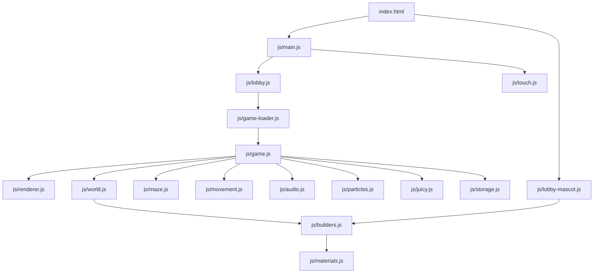

# Cubex Run

Documentación técnica, estado del proyecto y guía de mantenimiento.

> Última actualización: 2026-08-02  
> Estado visible en el juego: **v0.4 · provisional**

## 1. Resumen

**Cubex Run** es un juego web hypercasual de laberintos en 3D voxel, diseñado
principalmente para pantallas móviles en orientación vertical.

El jugador controla a **Cubex**, debe encontrar la salida de cada laberinto y
escapar antes de que un slime lo alcance. Cada nivel genera un laberinto nuevo.
El bucle está pensado para ser inmediato:

1. Entrar al lobby.
2. Pulsar **Iniciar carrera**.
3. Correr hacia la salida.
4. Escapar o ser atrapado.
5. Reintentar o avanzar al siguiente nivel.

No hay backend, cuentas, compras, anuncios ni servicios externos. El proyecto es
una aplicación estática formada por HTML, CSS, JavaScript ES Modules, Three.js y
Web Audio.

## 2. Estado actual

| Área | Estado |
| --- | --- |
| Lobby y Cubex 3D | Funcional |
| Generación procedural de laberintos | Funcional |
| Teclado y joystick táctil | Funcional |
| Colisiones y deslizamiento contra paredes | Funcional |
| Persecución del slime por BFS | Funcional |
| Derrota, reintento y siguiente nivel | Funcional |
| Música de persecución y efectos | Funcional |
| Persistencia del mejor nivel | Funcional mediante `localStorage` |
| Modo de efectos reducidos | Funcional |
| Rendimiento móvil | Optimizado |
| Pruebas automatizadas/CI | No existe un runner formal |
| Backend/telemetría | No existe |
| Estado de publicación | Prototipo jugable, todavía marcado como provisional |

### Validación técnica más reciente

- Flujo completo probado: lobby, inicio, movimiento, slime, derrota, reintento,
  victoria y siguiente nivel.
- 160 rutas procedurales comparadas contra una BFS de referencia sin errores.
- 20 regeneraciones consecutivas sin crecimiento de geometrías GPU.
- Escena reducida de aproximadamente 229 objetos a 7-8 objetos principales.
- Draw calls medidos reducidos de 33 a 11 en la escena de referencia.
- El juego normal carga sus recursos desde el propio proyecto, sin conexiones
  externas.

Estas cifras son una referencia de mantenimiento, no una garantía idéntica en
todos los dispositivos.

## 3. Cómo ejecutar el proyecto

El juego usa ES Modules e import maps. **No debe abrirse `index.html` directamente
con `file://`**. Debe servirse por HTTP.

Desde la raíz del proyecto:

```powershell
python -m http.server 8080
```

Después abrir:

```text
http://localhost:8080/
```

También sirve cualquier servidor estático moderno.

### URLs útiles

| URL | Uso |
| --- | --- |
| `/?autoplay=1` | Oculta el lobby e inicia una partida automáticamente |
| `/?debug=1` | Activa `window.__maze2`, el API interno de diagnóstico |
| `/?debug=1&autoplay=1` | Inicia directamente con herramientas de diagnóstico |

## 4. Controles

### Escritorio

- Movimiento: `WASD`
- Movimiento alternativo: flechas

### Móvil

- Tocar y arrastrar sobre el área de juego crea un joystick virtual.
- El joystick usa el eje dominante; no permite diagonales.
- Los botones y overlays no activan el joystick.

## 5. Reglas de juego actuales

Los valores principales viven en `js/config.js`.

| Parámetro | Valor | Significado |
| --- | ---: | --- |
| Resolución lógica | 540 × 960 | Formato vertical 9:16 |
| Columnas | 11 | Ancho del laberinto |
| Filas | 13 | Alto del laberinto |
| Velocidad de Cubex | 5.0 | Unidades por segundo |
| Velocidad del slime | 4.8 | Unidades por segundo |
| Aparición del slime | 500 ms | Demora después de empezar (se amplía a 1500 ms si el BFS al spawn queda < 7) |
| Fade del slime | 1.2 s | Tiempo antes de perseguir |
| Radio de niebla | 3 | Distancia Manhattan visible |
| Repath enemigo | 200 ms | Frecuencia de recálculo BFS |
| Distancia de derrota | Menor que 0.75 | O compartir la misma celda |
| Distancia de victoria | Menor que 0.6 | Respecto al centro de la salida |

El slime aparece en la celda transitable con mayor **distancia BFS** desde el
spawn del jugador `(1,1)`, descartando la propia celda del jugador y la salida,
y exigiendo ≥5 Manhattan de la salida. Esto evita el caso anterior en el que
una celda "lejana en Manhattan" quedaba conectada al spawn por un pasillo
corto y regalaba la derrota. Si la mejor celda tiene BFS < `SLIME_MIN_BFS_DIST`
(7), se amplia `SLIME_SPAWN_DELAY_MS` con un head start extra
(`SLIME_FALLBACK_DELAY_MS` = 1500 ms) para que el jugador tenga margen real
de reacción en laberintos patológicamente estrechos.

## 6. Arquitectura



### Decisiones importantes

- `main.js` y el lobby cargan primero.
- `game.js` está **precargado**, pero se evalúa mediante import dinámico al pulsar
  Jugar. Así el renderer principal no consume GPU mientras solo se ve el lobby.
- El lobby tiene un renderer pequeño independiente para Cubex.
- El renderer del lobby deja de animar cuando el lobby está oculto o la pestaña
  no está visible.
- El loop principal se pausa al ocultar la pestaña.
- Después de victoria o derrota, el loop termina cuando finalizan partículas y
  knockback. Reintentar o regenerar lo vuelve a iniciar.

## 7. Flujo de ejecución

### Carga inicial

1. `index.html` muestra el lobby.
2. Una imagen inline contiene el primer frame real de Cubex, por lo que el
   personaje aparece antes de que WebGL esté preparado.
3. `main.js` conecta botones, almacenamiento y controles táctiles.
4. `lobby-mascot.js` crea el Cubex 3D y sustituye el primer frame estático sin
   transición visible.
5. El juego principal todavía no ha creado el mundo.

### Inicio de partida

1. `lobby.js` recibe el clic.
2. Web Audio se desbloquea mediante el gesto del usuario.
3. `game-loader.js` importa `game.js`.
4. `resetMaze()` genera el mundo y arranca el loop.
5. El caller configura `state.slimeSpawnAt`.
6. El lobby se oculta.

### Persecución

1. El slime aparece después de `SLIME_SPAWN_DELAY_MS`.
2. Durante `FADE_IN_S` aumenta su opacidad.
3. Cada `ENEMY_REPATH_MS`, una BFS calcula:
   - distancia al jugador;
   - siguiente celda del camino.
4. El slime avanza hacia esa celda.
5. El HUD, audio y nivel de peligro se actualizan según la distancia.

### Fin de ronda

- **Derrota:** proximidad menor a 0.75 o misma celda.
- **Victoria:** Cubex entra en el radio de la salida.
- Se muestra un overlay, se reproduce feedback y el loop se detiene al terminar
  los efectos.
- **Reintentar** conserva el mismo laberinto.
- **Nueva** o **Siguiente nivel** incrementa el nivel y genera otro laberinto.

### Pausa y regreso al lobby (2026-08-03)

- `Esc` o `P` durante `playing` pausa el juego. El loop se detiene; la
  escena queda congelada.
- El overlay de pausa ofrece **Continuar** (reanuda el loop) y **Volver al
  lobby** (limpia el world y muestra el lobby).
- Los overlays de **derrota** y **victoria** también tienen **Volver al
  lobby** como botón secundario.
- `returnToLobby()` hace reset duro: cancela el frame, llama `clearWorld()`,
  tira el slime, el player y la salida, resetea `state.level` a 1 y muestra
  el lobby. El canvas queda con el background (oscuro) listo para el lobby.
- El guard de re-arranque de `lobby.js` usa `state.phase === 'lobby'`, no un
  closure booleano, así que volver al lobby desde el juego siempre re-habilita
  el botón "INICIAR CARRERA".

## 8. Estado global

El estado principal se exporta desde `js/game.js`:

```js
state = {
  phase,
  level,
  startTime,
  slime,
  slimeAlive,
  slimeAppearTime,
  slimeSpawnAt,
  slimeDistToPlayer,
  enemyTarget,
  enemyTargetX,
  enemyTargetZ,
  lastRepath,
  lastAudioUpdate,
  nextHeartbeatAt,
  slimeOpacity,
  distToExit,
}
```

Valores válidos de `phase`:

- `lobby`
- `playing`
- `paused`
- `lose`
- `win`

### Invariante crítica del temporizador

`resetMaze()` deja:

```js
state.slimeSpawnAt = Infinity;
```

El código que inicia una nueva ronda debe armarlo después:

```js
state.slimeSpawnAt = performance.now() + cfg.SLIME_SPAWN_DELAY_MS;
```

`retrySameMaze()` sí configura este temporizador internamente.

No cambiar esta relación sin revisar `lobby.js`, `main.js`, `game.js` y los hooks
de prueba.

## 9. Módulos

| Archivo | Responsabilidad |
| --- | --- |
| `index.html` | Markup, HUD, lobby, overlays, CSS, import map y preload |
| `js/main.js` | Botones globales, niveles, reintento y compartir |
| `js/game-loader.js` | Import dinámico único y reutilizable de `game.js` |
| `js/lobby.js` | Inicio de partida, opciones, audio y accesibilidad |
| `js/lobby-mascot.js` | Renderer y animación facial de Cubex en el lobby |
| `js/game.js` | Estado, reset, spawn, loop, victoria y derrota |
| `js/config.js` | Balance y dimensiones |
| `js/renderer.js` | Renderer, escena, luces y cámara principal |
| `js/maze.js` | Generación DFS, colisiones de celda y BFS |
| `js/world.js` | Instancias del laberinto, coordenadas y niebla |
| `js/builders.js` | Construcción voxel de Cubex, slime y salida |
| `js/materials.js` | Materiales y temas visuales por nivel |
| `js/movement.js` | Movimiento, hop, facing, knockback y cámara |
| `js/input.js` | Abstracción de acciones, teclado y buffering |
| `js/touch.js` | Joystick táctil |
| `js/audio.js` | Web Audio, efectos y música de persecución |
| `js/particles.js` | Pool y actualización de partículas |
| `js/juicy.js` | Shake, trauma, hit-stop, flash y efectos reducidos |
| `js/storage.js` | Persistencia local |
| `js/hooks.js` | API de pruebas habilitada con `?debug=1` |

## 10. Laberinto y pathfinding

### Generación

`generateMaze()` usa DFS con backtracking:

- empieza en `(1, 1)`;
- avanza de dos en dos;
- abre la pared intermedia;
- garantiza entrada y salida transitables;
- fuerza al menos dos direcciones cerca del inicio y de la salida.

### BFS

`bfsNextStepAndDistance()` devuelve en una sola búsqueda:

- el siguiente paso hacia el objetivo;
- la distancia total.

Usa buffers tipados reutilizables para evitar basura por frame.

**Importante:** el objeto y el array devueltos son compartidos y mutables. Deben
consumirse inmediatamente. Si otra funcionalidad necesita conservar el resultado,
debe copiarlo:

```js
const result = bfsNextStepAndDistance(sr, sc, tr, tc);
const savedStep = result.step ? [...result.step] : null;
```

## 11. Renderizado y rendimiento

### Renderer principal

- Cámara ortográfica.
- Resolución lógica 540 × 960.
- Pixel ratio adaptativo con máximo 1.5.
- `powerPreference: "high-performance"`.
- Sin stencil.

### Laberinto instanciado

El suelo y los muros usan `THREE.InstancedMesh`:

- suelo normal;
- suelo alterno;
- cuerpo de muro;
- parte superior del muro.

La niebla no crea ni destruye objetos. Cambia la matriz de las instancias ocultas
a escala cero y solo recalcula cuando Cubex cambia de celda.

### Geometría compartida

`builders.js` mantiene un cache de `BoxGeometry` por dimensiones. Cubex, slime,
salida y muros reutilizan esas geometrías.

Reglas:

- No llamar `geometry.dispose()` sobre geometrías marcadas como compartidas.
- `clearWorld()` sí llama `dispose()` sobre cada `InstancedMesh` para liberar sus
  buffers por instancia.
- Agregar geometrías únicas exige definir claramente quién las libera.

### Partículas

Las partículas reutilizan:

- una sola `BoxGeometry`;
- meshes y materiales clonados guardados en pools por tipo.

Cuando una partícula muere se oculta y vuelve al pool. Que existan meshes ocultos
en `scene.children` es normal y no representa una fuga.

### Feedback contra paredes

El feedback de choque tiene un cooldown de 140 ms. Esto evita:

- audio repetido cada frame;
- cientos de partículas;
- trauma excesivo;
- presión innecesaria sobre CPU/GPU.

## 12. Personajes y modelos

Los modelos son voxels construidos con cajas en `js/builders.js`.

- `buildGoblin()` construye a **Cubex**.
- `buildSlime()` construye al enemigo.
- `buildExit()` construye la salida.

El nombre interno `goblin` es legado. En producto y UI, el protagonista se llama
**Cubex**.

### Portada y personajes del lobby

El lobby es una portada arcade a pantalla completa, sin tarjeta ni selector de
modos. Presenta la premisa visualmente con el mismo `buildGoblin()` del gameplay
y un `buildSlime()` aislado mediante materiales clonados para no alterar el
fade del enemigo durante la partida.

`index.html` contiene `.logo-poster`, una captura inline de Cubex. Su objetivo es
evitar que el espacio quede vacío mientras se crea WebGL; desaparece de golpe
después del primer render estable.

Si cambia la cara, proporción, cámara, materiales o iluminación de Cubex:

1. Actualizar `buildGoblin()`, `buildSlime()` o `lobby-mascot.js`.
2. Renderizar la pose neutral.
3. Obtener `canvas.toDataURL("image/png")` inmediatamente después del primer
   `renderer.render(scene, camera)`.
4. Sustituir el `src` de `.logo-poster` en `index.html`.
5. Confirmar que no hay salto visual entre poster y modelo 3D.

## 13. Audio

`js/audio.js` usa Web Audio API.

### Restricción del navegador

El `AudioContext` debe crearse o reanudarse después de un gesto del usuario.
No intentar reproducir audio automáticamente al cargar.

### Persecución

- Archivo: `assets/audio/pursuit.wav`
- Duración: 4 segundos
- Formato: WAV mono, 44.1 kHz, 16 bits
- Se reproduce en loop.
- Volumen, filtro low-pass y playback rate cambian suavemente según distancia.
- El latido adicional solo aparece a tres celdas o menos.

Cuando se sustituya el archivo:

1. Mantener un loop sin clic audible.
2. Evitar clipping y frecuencias agresivas.
3. Probarlo en altavoz de teléfono.
4. Incrementar el query de cache en `audio.js`:

```js
new URL('../assets/audio/pursuit.wav?v=3', import.meta.url);
```

### Lifecycle

- El buffer de persecución se empieza a cargar en la primera interacción.
- El contexto se suspende al ocultar la pestaña.
- La música se detiene en victoria, derrota y reset.

## 14. Persistencia

Datos guardados en `localStorage`:

| Clave | Contenido |
| --- | --- |
| `voxelgobblin_bestTime` | Mejor tiempo histórico |
| `voxelgobblin_bestLevel` | Mejor nivel alcanzado |
| `voxelgobblin_reducedEffects` | Preferencia de efectos reducidos |

Las claves conservan el nombre interno antiguo `voxelgobblin`. No renombrarlas sin
una migración, porque se perdería el progreso guardado del usuario.

El almacenamiento es local al navegador y al origen. Cambiar entre
`localhost`, `127.0.0.1` y un dominio publicado produce historiales separados.

## 15. Temas visuales

`js/materials.js` contiene seis temas:

1. Mazmorra
2. Cripta
3. Volcán
4. Glaciar
5. Templo
6. Abismo

Se recorren de forma cíclica por nivel y reciben variaciones HSL procedurales.

Para agregar un tema:

1. Añadirlo a `THEMES`.
2. Mantener contraste entre suelo, suelo alterno, muro y parte superior.
3. Verificar legibilidad con niebla y HUD.
4. Probar al menos un ciclo completo de temas.

## 16. Debug y diagnóstico

Con `?debug=1`, `main.js` carga `hooks.js` y expone:

```js
window.__maze2
```

Capacidades principales:

- consultar `state`, jugador, slime, grid y fase;
- forzar spawn y fade del slime;
- resetear o reintentar;
- mover al jugador a la salida;
- simular victoria, derrota, pasos y choques;
- inspeccionar partículas, hop, facing, cámara y knockback;
- activar efectos reducidos;
- leer/escribir estado de audio;
- consultar celdas visibles.

Ejemplos:

```js
__maze2.getPhase()
__maze2.getPlayerCell()
__maze2.forceSlimeSpawn()
__maze2.movePlayerToExit()
__maze2.particlesCount()
__maze2.getParticlePoolSize()
```

Los hooks son herramientas de desarrollo y no deben convertirse en dependencias
del gameplay.

## 17. Operaciones comunes de mantenimiento

### Cambiar balance

Editar `js/config.js` y probar:

- velocidad relativa jugador/slime;
- tiempo de aparición;
- radio de niebla;
- frecuencia de BFS.

Cambiar varias variables a la vez dificulta saber cuál alteró la dificultad.

**Dato empírico (2026-08-03, `qa:bot-playtest`):** un bot BFS-greedy que
siempre va óptimo hacia la salida **pierde 10/10 partidas** con media
de 6.2s y 23 movimientos. La velocidad del jugador (5.0) supera a la
del slime (4.8) en línea recta, pero la geometría del laberinto más
la persecución por BFS del slime hacen que la huida óptima no baste.
Si el balance se cambia, re-ejecutar `npm run qa:bot-playtest` y mirar
si el completion rate sube. El target natural: 20-40% con un bot
BFS-greedy simple; los buenos jugadores humanos deberían rondar 60-80%.

### Cambiar el aspecto de Cubex

Editar `buildGoblin()` y actualizar también el poster del lobby.

### Cambiar el lobby

- Estructura y arte: `index.html`
- Comportamiento: `js/lobby.js`
- Cubex animado: `js/lobby-mascot.js`

No volver a introducir un icono CSS o un personaje distinto: el lobby debe mostrar
al mismo Cubex voxel del gameplay.

### Actualizar Three.js

1. Sustituir `assets/vendor/three.module.min.js`.
2. Conservar su cabecera de licencia MIT.
3. Actualizar la versión como una sola operación.
4. Probar `InstancedMesh.dispose()`, import maps, materiales y WebGL móvil.

### Cache busting manual

Cuando cambies cualquier archivo JS de `js/`, sube el sufijo `?v=N` de los
`<link rel="modulepreload">` en `index.html` (un único número para todos los
módulos). Sin este paso, el navegador puede servir la copia vieja aunque
`python -m http.server` esté sirviendo la nueva.

### Actualizar Fredoka

- Archivo: `assets/fonts/fredoka-latin.woff2`
- Licencia: `assets/fonts/OFL.txt`

Mantener ambos al redistribuir el juego.

### Canvas inspection y test hooks (QA local)

El juego expone dos hooks globales en modo `?debug=1`, siguiendo el contrato
de `threejs-qa-release` (cherry-pick del repo `majidmanzarpour/threejs-game-skills`):

- `window.__THREE_GAME_TEST_HOOKS__` — `setState('lobby'|'playing'|'lose'|'win')`,
  `seed(n)` y `setSeedAndRegenerate(n)` (este último fija la seed de la maze
  y devuelve la distancia BFS del spawn del slime).
- `window.__THREE_GAME_DIAGNOSTICS__` — `renderer.{calls,triangles,geometries,textures}`,
  `state.phase`, `state.slimeAlive`, `state.slimeDistToPlayer`, `world.children`.

El script `scripts/inspect-threejs-canvas.mjs` (copia del upstream) lanza
Playwright contra el server local, fuerza el estado y captura:

- `desktop-<state>.png` / `mobile-<state>.png` — screenshot
- `desktop-<state>.json` / `mobile-<state>.json` — reporte con
  color entropy, edge density, luminance contrast, render budget, GPU info,
  console errors y page errors

Comandos disponibles vía `npm run`:

| Script | Qué hace |
| --- | --- |
| `serve` | Levanta `python -m http.server 8080` |
| `inspect:canvas` | Captura lobby en desktop |
| `qa:desktop` | Captura lobby en desktop con `?debug=1` (hooks activos) |
| `qa:mobile` | Igual con emulación iPhone 13 |
| `qa:state-lobby` | Captura el lobby |
| `qa:state-playing` | Reset + slime inmediato, captura mid-play |
| `qa:state-lose` | Asegura playing y dispara `simulateLose` |
| `qa:state-win` | Asegura playing y dispara `simulateWin` |
| `qa:bfs-distribution` | Muestrea 30 mazes con seeds distintas, escribe `artifacts/qa/bfs-distribution.{md,json}` |

Ejemplo: en una terminal `npm run serve`; en otra, `npm run qa:state-playing`
o `npm run qa:bfs-distribution`. Exit code no-cero si hay console errors,
canvas en blanco, o cualquier seed produce BFS < 5.

**Métricas medidas el 2026-08-03** (state=playing, desktop, AMD Radeon):

| Métrica | Actual | Límite | OK |
| --- | ---: | ---: | :-: |
| Draw calls | 11 | 300 | ✓ |
| Triángulos | 2 164 | 750 000 | ✓ |
| Geometrías | 9 | 300 | ✓ |
| Texturas | 0 | 60 | ✓ |
| `world.children` | 8 | — | — |

**Distribución de BFS spawn (2026-08-03, 30 seeds, mulberry32 en `maze.js`):**

| Métrica | BFS |
| --- | ---: |
| Mín | 18 |
| p10 | 24 |
| Mediana | 33 |
| Media | 33.03 |
| p90 | 42 |
| Máx | 50 |
| StdDev | 8.44 |
| BFS < 5 | 0/30 |
| BFS < 7 (umbral fallback) | 0/30 |
| BFS == 0 (patológico) | 0/30 |

Comparativa: antes del fix BFS=3 en el maze por defecto (derrota en 6.3s).
Ahora 18-50 con media 33. El fallback de delay no se activa en ningún seed
probado.

**Bloqueadores restantes del ledger:**

- ~~La maze usa `Math.random`; `seed(n)` es un no-op.~~ **Resuelto** (mulberry32
  en `maze.js`, exportado vía `seedRng(seed)` / `resetRng()`).
- ~~No hay bot playtest todavía.~~ **Resuelto** (driver BFS-greedy
  en `scripts/bot-playtest.mjs`, 10 partidas, completion rate 0% — dato
  que ya está alimentando la decisión de balance).
- No hay visual test harness (baselines PNG). El inspector ya deja el
  PNG en `artifacts/canvas-inspection/`; el siguiente paso es comparar
  contra un golden con tolerancia.

## 18. Invariantes que no deben romperse

1. `resetMaze()` no arma por sí solo la aparición del slime.
   Si en el futuro se quiere mover la lógica del spawn de slime, respetar que
   el caller arma `state.slimeSpawnAt` y que el loop puede extenderlo si
   `pickSlimeSpawnCell()` devuelve BFS < `SLIME_MIN_BFS_DIST`.
2. `retrySameMaze()` conserva el grid y los meshes del laberinto.
3. El resultado combinado de BFS es compartido y mutable.
4. Las geometrías del cache de `builders.js` no se eliminan por ronda.
5. Los `InstancedMesh` sí deben liberar sus buffers al limpiar el mundo.
6. Los meshes ocultos del pool de partículas deben permanecer en la escena.
7. El renderer principal no debe arrancar antes de que se necesite el juego.
8. El renderer del lobby no debe seguir animando detrás del gameplay.
9. El loop debe reanudarse en reset/retry y detenerse al terminar los efectos.
10. El audio requiere interacción del usuario.
11. La UI debe mantener el nombre **Cubex Run** y el personaje **Cubex**.
12. `state.phase` solo toma valores `lobby | playing | paused | lose | win`. El pause
    es opt-in (teclado) y nunca se activa automáticamente. El guard de re-arranque
    de `lobby.js` consulta `state.phase`, no un closure booleano.

## 19. Lista de regresión

Ejecutar esta lista después de cambios relevantes.

### Carga y lobby

- [ ] El lobby aparece sin pantalla vacía.
- [ ] Cubex aparece inmediatamente y no cambia de cara al cargar.
- [ ] Cubex tiene animación facial estable.
- [ ] La fuente Fredoka carga localmente.
- [ ] El botón Jugar responde al primer toque.
- [ ] Opciones, audio y efectos reducidos funcionan.

### Gameplay

- [ ] WASD y flechas mueven a Cubex.
- [ ] El joystick táctil aparece, sigue el dedo y se limpia al soltar.
- [ ] Cubex no atraviesa paredes.
- [ ] Mantenerse contra una pared no produce spam de sonido/partículas.
- [ ] La cámara sigue al jugador sin saltos.
- [ ] La niebla cambia al pasar de celda.

### Slime y audio

- [ ] El slime aparece después de 500 ms.
- [ ] Completa el fade antes de perseguir.
- [ ] Encuentra al jugador por el laberinto.
- [ ] El HUD muestra distancia y peligro.
- [ ] La música de persecución entra suavemente y no satura.
- [ ] Silenciar audio afecta música y efectos.

### Resultados

- [ ] El contacto visual/celda compartida produce derrota.
- [ ] El overlay de derrota deja de agitar el canvas.
- [ ] Reintentar conserva el laberinto.
- [ ] Llegar a la salida produce victoria.
- [ ] Siguiente nivel incrementa el HUD y genera otro laberinto.
- [ ] El mejor nivel persiste tras recargar.
- [ ] Compartir usa Web Share o portapapeles.

### Rendimiento

- [ ] La escena normal mantiene alrededor de 11 draw calls.
- [ ] `world.children` permanece alrededor de 7-8.
- [ ] Regenerar 20 veces no aumenta continuamente las geometrías.
- [ ] El loop se detiene cuando termina un overlay.
- [ ] La pestaña oculta no mantiene audio ni animación activa.

## 20. Limitaciones y deuda técnica

> **Estado QA (2026-08-03):** El juego ahora tiene harness de canvas
> inspection funcional. Ver §17.5 para cómo correrlo. Pause + return to
> lobby añadidos en el mismo turno. El resto de la deuda listada a
> continuación sigue vigente.

- El juego sigue marcado como `v0.4 · provisional`.
- ~~No hay pantalla de pausa o navegación de regreso al lobby.~~ **Resuelto** (Esc/P pausa, "Volver al lobby" en pause/lose/win).
- ~~No hay suite automatizada, CI ni pruebas en dispositivos como parte del repo.~~ **Resuelto parcialmente** (harness: canvas inspector + memory test + bot playtest + BFS distribution). Falta CI en la nube.
- No hay sistema formal de releases ni cache busting global de JavaScript.
  Mitigación parcial: `index.html` lleva meta-tags `Cache-Control: no-cache` y los
  `modulepreload` JS usan sufijo `?v=N` que se incrementa manualmente al
  cambiar el bundle. Hace falta un mini paso de build o un servidor de
  desarrollo que inyecte un hash para no olvidar bumpearlo.
- No hay pantalla de pausa o navegación de regreso al lobby.
- `cfg.currentMode` existe, pero solo hay un modo de juego real.
- Algunas variables y claves conservan nombres antiguos como `goblin`,
  `voxelgobblin` y `__maze2`.
- No hay analítica de retención, errores o rendimiento real de usuarios.
- No hay un archivo de licencia general para el código original del juego.
- WebGL, Web Audio, ES Modules e import maps requieren navegadores modernos.

## 21. Privacidad y red

- No se envían datos de juego a un servidor.
- No existe autenticación.
- El progreso permanece en `localStorage`.
- La acción Compartir usa APIs del navegador.
- Three.js y Fredoka están incluidos localmente.

## 22. Estructura del proyecto

```text
DemoMaze2/
├── index.html
├── README.md
├── assets/
│   ├── audio/
│   │   └── pursuit.wav
│   ├── fonts/
│   │   ├── fredoka-latin.woff2
│   │   └── OFL.txt
│   └── vendor/
│       └── three.module.min.js
└── js/
    ├── audio.js
    ├── builders.js
    ├── config.js
    ├── game.js
    ├── game-loader.js
    ├── hooks.js
    ├── input.js
    ├── juicy.js
    ├── lobby.js
    ├── lobby-mascot.js
    ├── main.js
    ├── materials.js
    ├── maze.js
    ├── movement.js
    ├── particles.js
    ├── renderer.js
    ├── storage.js
    ├── touch.js
    └── world.js
```

## 23. Criterio para dar mantenimiento

Una modificación no está terminada solo porque compila o se ve correcta en una
captura. Debe:

1. Probarse dentro de una partida real.
2. Verificarse en lobby y gameplay.
3. Cubrir inicio, derrota, retry y victoria si toca estado global.
4. Revisarse en móvil si afecta UI, input, audio o rendimiento.
5. Compararse con las invariantes y la lista de regresión de este documento.
